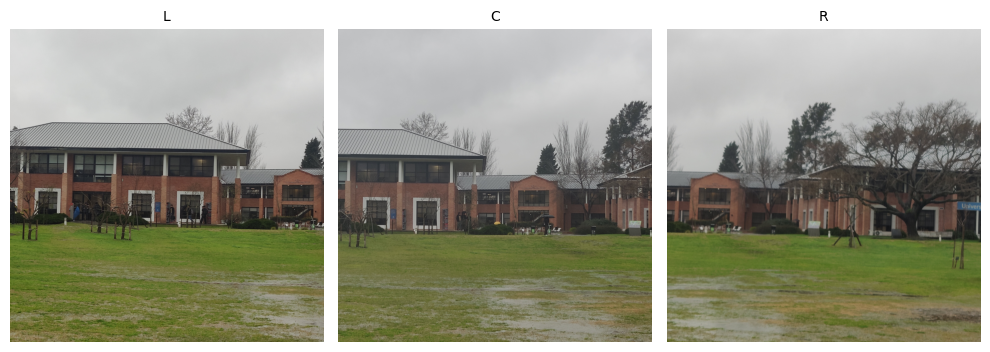
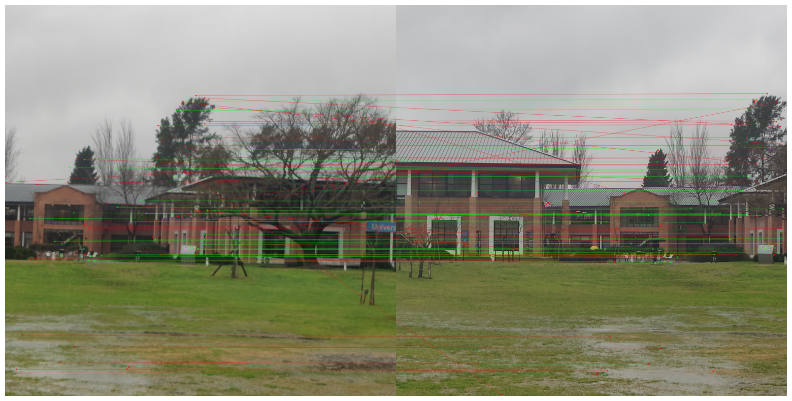
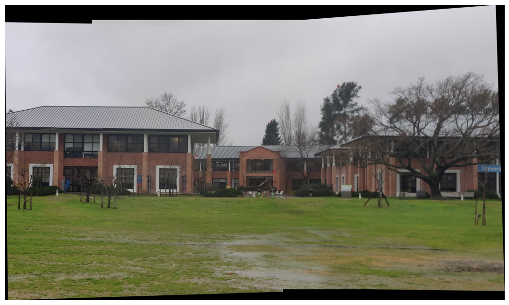

# Panorámica — Stitching de Imágenes con SIFT y RANSAC

Implementación desde cero (sin usar `cv2.Stitcher`) de un pipeline clásico de *image stitching*: dado un conjunto de fotos con solapamiento, genera una imagen panorámica única, resolviendo cada etapa del algoritmo manualmente para entender su funcionamiento interno.

Trabajo práctico de la materia **Visión Artificial (I308) — Universidad de San Andrés**.

## Tech Stack

- **Lenguaje:** Python 3.13
- **Visión por computadora:** OpenCV (`opencv-python`, `opencv-contrib-python`) — SIFT, `BFMatcher`, warping
- **Cómputo numérico:** NumPy (SVD, álgebra lineal para DLT)
- **Visualización:** Matplotlib
- **Entorno:** Jupyter Notebook
- **SO:** Multiplataforma (probado en macOS)

## Características clave

- **Detección de características (SIFT):** extracción de keypoints y descriptores por imagen.
- **ANMS (Adaptive Non-Maximal Suppression):** selección de los keypoints más relevantes y mejor distribuidos espacialmente, implementada desde cero.
- **Matching de descriptores:** correspondencias por *ratio test* de Lowe + verificación cruzada (*mutual best match*).
- **Estimación de homografía (DLT):** cálculo de la matriz de homografía por Direct Linear Transform, con normalización isotrópica de puntos.
- **RANSAC propio:** eliminación robusta de outliers en las correspondencias, con parada adaptativa por umbral de inliers.
- **Stitching de 3 imágenes:** proyección al plano de la imagen central, compensación simple de exposición y *blending* por *feathering* (distance transform) para disimular costuras.
- **Visualizaciones del proceso:** keypoints, correspondencias lado a lado e inliers/outliers de RANSAC.

## Instalación y ejecución

```bash
git clone <URL_DEL_REPO>
cd vision-panoramica
```

```bash
python3 -m venv .venv
source .venv/bin/activate
pip install -r requirements.txt jupyter
```

```bash
jupyter notebook tp1_pano..ipynb
```

> El notebook [`fotos_nuestras.ipynb`](fotos_nuestras.ipynb) corre el mismo pipeline sobre un set de fotos propio (`img/fotos nuestras/`).

Ejecutar las celdas en orden: carga de imágenes → detección de características → ANMS → matching → homografía (DLT) → RANSAC → stitching final.

> **Nota:** el selector manual de puntos (`pick_points_cv`, en [`src/utils.py`](src/utils.py)) abre una ventana nativa de OpenCV (`cv2.imshow`), por lo que requiere entorno gráfico local (no funciona en Colab o servidores headless).

## Resultados

**1. Imágenes de entrada** (izquierda / centro / derecha, con solapamiento):



**2. Matching de descriptores + RANSAC** — líneas verdes son inliers (correspondencias correctas), rojas son outliers descartados por RANSAC:



**3. Panorámica final** — las 3 imágenes proyectadas al plano central y fusionadas con feathering:



Para más detalle del desarrollo y las decisiones de diseño, ver el informe: [`Szterensus_Distefano_tp1_informe.pdf`](Szterensus_Distefano_tp1_informe.pdf).
